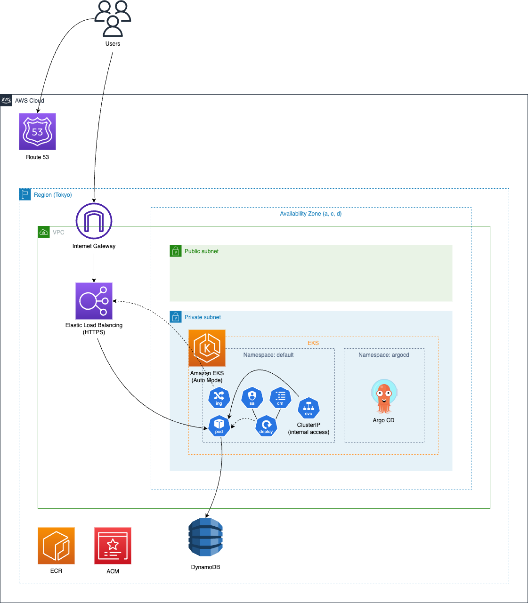

# eks-project-example

Repository for testing EKS Auto Mode.

The architecture to be created is as follows:

Contents to be tested:

- Creation of an EKS Cluster with EKS Auto Mode enabled
- Access control per Service Account using Pod Identity
- EC2 management using Managed Karpenter
- Creation of ALB and Target Groups using the Managed Load Balancer Controller

List of repositories used:

- https://github.com/gotokazuki/terraform-aws-eks
- https://github.com/gotokazuki/terraform-aws-network
- https://github.com/gotokazuki/terraform-aws-ecr
